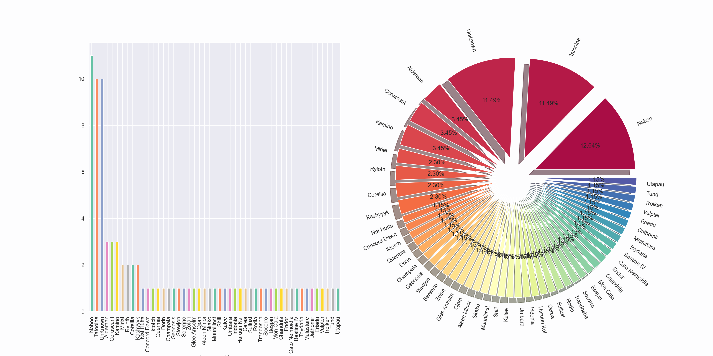

# [DA-Learning] Starwars

## 1. 데이터 보기.

**[tip] 범주형 변수와 연속형 변수를 미리 구분해놓으면 데이터 분석 시에 유리하다.**

```
df.info() # 연속형 변수 vs 범주형 변수
df.describe() # 통계치 볼 수 있다.
```

1. 범주 확인하기.
   : 범주가 적으면 범주 별로 그래프를 그릴 수 있기 때문이다.

```
print("hair_color : ", df["hair_color"].unique())
print("skin_color : ", df["skin_color"].unique())
print("eye_color : ", df["eye_color"].unique())
print("sex : ", df["sex"].unique())
print("gender : ", df["gender"].unique())
print("homeworld : ", df["homeworld"].unique())
print("species : ", df["species"].unique())
# 범주가 적으면, 범주 별로 그래프를 그리기 쉬워진다.
```

2. 결측치 파악하기.
   : ((결측치의 개수) / (전체 데이터의 개수)) \* 100 처리를 하면, 전체 데이터의 몇 퍼센트가 결측치인지 알 수 있다.

```
print("총 데이터의 개수 : ", df.shape[0]*df.shape[1])
# f-string <문자열 포맷팅>
print(f"총 결측치의 개수 : {df.isnull().sum().sum()} = 전체 데이터의 {(df.isnull().sum().sum())/(df.shape[0]*df.shape[1])*100:.2f}%") # 소수점 아래 두 번째 까지 표기하기.
print("스타워즈에 나오는 주인공의 수 : ", df["name"].nunique()) # 동명이인이 존재하지 않음을 알 수 있다.
print("스타워즈에 나오는 종의 수 : ", df["species"].nunique())
```

## 2. 데이터 보고, 질문하기.

### 강사의 질문

- 스타워즈 캐릭터의 성별 비율?
- 성별에 따른 캐릭터 신장의 분포?
- 가장 무거운 캐릭터와 가장 가벼운 캐릭터
- 스타워즈 캐릭터의 키와 몸무게는 상관 관계를 가질까?

### 나의 질문

- 스타워즈 캐릭터의 피부 색깔과 머리 색깔이 상관 관계를 가질까?
- 스타워즈 캐릭터의 고향의 분포?
- 스타워즈 캐릭터의 종과 눈 색깔은 상관 관계를 가질까?
- gender에 따른 종의 분포?

## 3. 데이터 정비하기.

### 3-1. 결측치 처리하기.

```
df.isnull().sum() # 몇 개의 np.nan이 들어 있는지 알 수 있다.
df.isnull().any(axis=0) # 하나라도 True이면 True를 반환해준다. (하나라도 np.nan 값이 있으면 True라고 반환해준다.)
```

**[tip] 고유한 특성은 그대로 내버려두도록 하기. 그리고 몸무게나 키는 그냥 0으로 처리해주기.**

1. 몸무게나 키는 0으로 채워주기.

```
df_copy["height"].fillna(0, inplace=True)
df_copy["mass"].fillna(0, inplace=True)
```

2. 고유한 특성은 그냥 내버려두기. 하지만 sex가 none 값을 여기 분석에서는 robot으로 고쳐주었다.

```
print(df_copy.loc[df_copy["sex"]=="none"])
print(df_copy.loc[df_copy["sex"].isnull()]) # sex가 np.nan인 값을 보여주기.

# sex가 none인 값은 robot으로 넣어주기.
df_copy.loc[df_copy["sex"]=="none", "sex"]="robot"
print("Sex : ", df_copy["sex"].unique())
```

## 4. EDA & Visualization

### 4-1. Starwars 캐릭터들의 성비 비율?

: sex와 gender로 나눠서 한 쪽은 pie를 다른 한쪽은 countplot을 이용해서 비율과 개수를 나타내고 있다.

```
pie 그래프를 그리는 경우에 sort_values 이용하기.
```


### 4-2. Starwars 캐릭터의 성별에 따른 신장 분포?

: sex와 gender 별로 나눠서 한 쪽은 histplot을 이용하고, 다른 한 쪽은 kdeplot을 이용해서 개수와 밀도를 나타내고 있다.

**[tip] 특수한 경우는 (오로지 경우가 1개인 경우) 분포를 나타낼 때에는 제외하는 것이 더 낫다.**


> **그래프 분석 내용**

- 남성 캐릭터가 여성 캐릭터보다 더 키가 큰 쪽으로 분포 되어있다.
- 로봇은 남성, 여성보다는 키가 더 작은 쪽에 분포되어 있다. (물론 키가 같은 경우도 존재한다.)

### 4-3. 가장 가벼운 캐릭터와 가장 무거운 캐릭터 & 종족 간 몸무게 비교?

: 몸무게가 0인 데이터는 빼고 진행하기.

```
weight=df_copy[["species", "mass"]].groupby(["species"]).mean()
weight # mass를 groupby 처리해주기.
```


상위 10개만 bar graph로 그려보았다.


모든 데이터를 bar graph로 그려보았다.

```
massOut1=df_copy.loc[df_copy["species"]=="Hutt"]
massOut2=df_copy.loc[df_copy["mass"]==0]
print(massOut1) # 제외 데이터 1
print(massOut2) # 제외 데이터 2
```

> **분석 내용**

- 최소 몸무게 15.0를 가진 캐릭터 이름은 Ratts Tyerell이다.
- 최대 몸무게 1358.0를 가진 캐릭터 이름은 Jabba Desilijic Tiure이다.

### 4-4. Starwars 캐릭터의 키와 몸무게는 상관관계를 가질까?

:이상 데이터는 drop을 이용해서 제외 시키기.

- 종족이 Hutt 같은 경우 outline data > 제외 시키기.
- 몸무게가 0인 경우 > 제외 시키기.

회귀선을 통해서 상관 관계를 알 수 있다.


gender 별로 상관 관계를 파악할 수 있다. 하지만, 여성의 데이터가 적기 때문에 올바른 상관 관계라고 보기 어렵다.

### 4-5. 스타워즈 캐릭터의 고향의 분포?

: value_counts()를 이용해서 homeworld의 개수를 셀 수 있었다. 이를 이용해서 bar와 pie를 그렸다.



Naboo 출신이 가장 많았고, 생각보다 고향을 알 수 없는 캐릭터들이 거의 11% 정도 차지하고 있었다. 그리고 각자 고향이 다른 경우도 굉장히 많았다.

### 4-6. 스타워즈 캐릭터의 종과 눈 색깔의 분포?

: scatterplot을 이용해서 어떻게 분포하고 있는지 시각적으로 나타내었다. 처음에는 상관 관계를 알고 싶었는데, 수치가 아닌 값으로 상관 관계를 알아낼 수 없었다.


종에 따라 눈 색이 다른 편이고, 같은 종이라도 눈 색이 다른 경우가 많이 보인다. 따라서 종과 눈 색깔과의 관련성은 없어 보인다.

### 4-7. gender에 따른 종의 분포?

: histplot을 이용해서 분포를 알아보았다.


feminine의 데이터 수가 적어서 상대적으로 수치가 낮게 나왔다. 하지만 feminine, masculine 모두 Human이 많다.

## 5. Review

: 어떤 데이터를 더 붙이면 좋을지, 리뷰 등등을 의미한다. (부족한 공부, 어떤 공부를 더 해야되는지 등)

- 총 데이터의 개수 : 957
- 총 결측치의 개수 : 105 = 전체 데이터의 10.97%
- 스타워즈에 나오는 주인공의 수 : 87
- 스타워즈에 나오는 종의 수 : 37

- masculine은 전체 gender의 79.52%이다.
- feminine은 전체 gender의 20.48%이다.

- 남자 캐릭터가 키가 큰 편에 속하고, 로봇은 남자와 여자보다 키가 작은 편에 속한다.

- 최소 몸무게 15.0를 가진 캐릭터 이름은 Ratts Tyerell이다.
- 최대 몸무게 1358.0를 가진 캐릭터 이름은 Jabba Desilijic Tiure이다.

- Starwars 캐릭터의 키와 몸무게는 대체로 비례 관계를 보인다. 즉, 상관 관계를 가진다.
  : 남자 캐릭터는 데이터가 많아서 상관 관계를 보일 수 있지만, 여자 캐릭터는 비교적 데이터의 수가 작아서 올바른 상관 관계라고 보기 어렵다. 몸무게에 0이 아닌, 다른 데이터가 충족 된다면 제대로 알 수 있을 것 같다.

- Naboo 출신이 가장 많았고, 생각보다 고향을 알 수 없는 캐릭터들이 거의 11% 정도 차지하고 있었다. 그리고 각자 고향이 다른 경우도 굉장히 많았다.

- 종에 따라 눈 색이 다른 편이고, 같은 종이라도 눈 색이 다른 경우가 많이 보인다. 따라서 종과 눈 색깔과의 관련성은 없어 보인다.

- feminine의 데이터 수가 적어서 상대적으로 수치가 낮게 나왔다. 하지만 feminine, masculine 모두 Human이 많다.
